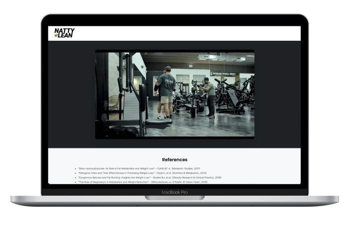

# H&W Development Challenge

O **H&W Development Challenge** é uma aplicação web desenvolvida como parte de um teste técnico da empresa **H&W Publishing**. O projeto foi estruturado com foco em responsividade, reuso de componentes, clareza visual e boas práticas de desenvolvimento front-end.

## Visão Geral

Esta aplicação simula um processo de compra, incluindo um vídeo promocional, visualização de produto, confirmação de pedido, entrega de bônus digital (ebook) e exibição dos dados do cliente. O sistema é 100% estático e foi desenvolvido visando uma navegação intuitiva, moderna e compatível com dispositivos móveis.

## Tecnologias Utilizadas

O projeto **H&W Development Challenge** foi desenvolvido com as seguintes tecnologias:

- **HTML 5**
- **CSS 3**
- **JavaScript**
- **Bootstrap 5** 

##  Funcionalidades

- Player de vídeo responsivo (YouTube Embed)
- Confirmação de pedido com visualização do produto comprado
- Exibição condicional de bônus (ebook)
- Detalhamento dos dados do cliente na confirmação
- Componentização com HTML estático para header e footer
- Publicado via GitHub Pages

## Como clonar e executar o projeto

### Pré-requisitos

- Editor de código (ex: VS Code)
- Navegador moderno (ex: Chrome, Edge)

### Passos

1. Clone o repositório:

```bash
git clone https://github.com/DiogooRodrigoo/hewDevelopmentChallenge.git
```

2.	Acesse o diretório do projeto:
```bash
cd hwDevelopmentChallenge
```

3. Abra o arquivo `index.html` no navegador ou use um servidor local para visualização:

#### Opção 1: Live Server (VS Code)

- Instale a extensão **Live Server**
- Clique com o botão direito no arquivo `index.html`
- Selecione **Open with Live Server**


####  Opção 2: http-server (Node.js)

```bash
npm install -g http-server
http-server
```

## Screenshots



##

Com essas orientações, você conseguirá clonar o repositório, instalar as dependências e executar o projeto **Natty Lean Order Confirmation** localmente. Caso precise de suporte ou tenha dúvidas, fique à vontade para entrar em contato.

Desenvolvido por **Diogo Rodrigo Pedreira Galvão**, 2025.  
Este software foi desenvolvido exclusivamente para fins de avaliação técnica pela empresa **H&W Publishing**. Todos os direitos de imagem, marca e conteúdo estão reservados à empresa mencionada.
